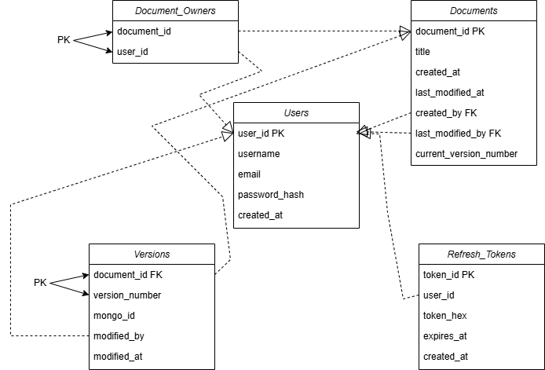

# IzanagiDB Design Evolution & Roadmap

## Phase 1: Data Modeling (The "Pen & Paper" Phase)

I will start by defining the contract between my two databases to ensure the hybrid setup is efficient. 

* **PostgreSQL.** I will focus on the "Who, When, and Where". I think we only need 5 tables:

    * **Users Table:** I will include `user_id` (Primary Key), `username` (Unique), and `email` (Unique) to handle account security, along with a `password_hash` string to store salted credentials. 

    * **Documents Table:** This will store ownership metadata including `document_id` (Primary Key) and timestamps. I will use Foreign Keys for `created_by` and `last_modified_by` to maintain relational integrity. 

    * **Document_Owners Table:** Instead of using a list column (which PostgreSQL doesn't support for Foreign Keys), I will use this **Junction Table** to handle the Many-to-Many relationship between users and documents, allowing for multiple owners per file.

    * **Versions Table:** I will track the history list here.  This table will use a **Composite Primary Key** consisting of `document_id` and `version_number` to ensure versioning is unique to each specific document. I will also include a `CHECK` constraint to ensure `version_number` is a non-negative integer. Most importantly, this table includes a `mongo_id` (string) to act as the "pointer" to the actual document content stored in the Warehouse. 
    * **RefreshTokens Table:** To support my two-token authentication strategy, I will add this table to store 30-day random string tokens (Unique) linked to `user_id` (Foreign Key), allowing me to revoke sessions if needed.

Here is the rough sketch of how these tables interact with each other:

  

* **MongoDB.** I will use this to store the actual flexible document content. I’ve decided to store the **Full State** for the latest version and **Deltas** (patches) for all previous versions to optimize storage.
    * **Collection Structure:** I will use a single collection called `Document_Contents`. I only need one collection because MongoDB's schema-less nature allows me to store both full snapshots and patch objects in the same place, differentiated by a `type` field.
    * **Schema Design:** Each MongoDB document will map 1:1 to an entry in my PostgreSQL `Versions` table via the `mongo_id`.
    * **Latest Version:** Stored as `{ "type": "snapshot", "content": { ... } }`. This allows for instant retrieval of the "live" document without any processing.
    * **Previous Versions:** Stored as `{ "type": "delta", "patch": [ ... ] }`. These patches will represent the difference between that version and the one that followed it.

    * **The "Commit" Workflow:** When I hit the "commit" button in SvelteKit:
        1. The backend fetches the current "Full State" from MongoDB.
        2. It calculates the delta (using a library like `jsonpatch`) between the old state and the new commit.
        3. It updates the old MongoDB document to `type: "delta"` and saves the patch.
        4. It inserts the new commit as a new `type: "snapshot"`.

    * **Why this approach?** This "Reverse Delta" strategy ensures that the most frequent action - viewing the current document - is as fast as possible. I only pay the computational cost of "reconstructing" a version when a user specifically wants to look at the history or perform a diff.

## Phase 2: Infrastructure & Persistence

I need to connect these databases to the FastAPI backend and ensure they stay persistent within Docker.

* **The Python Connection:** I will use **SQLAlchemy 2.0** with async support to map my Python 3.14 classes to PostgreSQL tables. For MongoDB, I'll use **Motor** to handle asynchronous connections from FastAPI.

* **The Dependency Update:** Since I am switching to **PyJWT** for RS256 support, I must update my `python_requirements.txt` and install it instead of `python-jose`.
* **Docker Persistence:** To prevent my data from vanishing when I stop the containers, I will use **Volumes** in my `docker-compose.yml`. I'll map local folders on my machine to the internal storage paths of the databases.

* **Schema Management:** I will use **Alembic** as a migration tool for SQLAlchemy. This allows me to define my tables once in Python and have them automatically created or updated in the PostgreSQL container whenever the stack starts.

## Phase 3: The API Backbone (Backend)

I'll build the API logic first and test it using the built-in FastAPI `/docs` (Swagger) UI.

* **Authentication:** I will implement a two-token JWT strategy.
    * **Access Token:** A 30-minute JWT signed with **RS256** containing user claims.
    * **Refresh Token:** A 30-day random string stored in PostgreSQL for stateful revocation.
    * **Security:** I will use `httpOnly` and `SameSite=Lax` cookies to mitigate XSS and CSRF. I'll stick to `Lax` rather than `Strict` to ensure a smoother user experience when navigating to the app from external links, and I'll skip HTTPS for now as it's a side project.

* **Endpoints:** After `/auth`, I will move to the `/documents` routes for handling the actual uploads and version retrieval.

* **The Logic:** I'll write the core logic that orchestrates both databases: saving the "who/when" metadata and refresh tokens to Postgres and the "what" content to MongoDB.

## Phase 4: Frontend Development (Svelte 5)

Once the API is ready, I will build the user interface on Port 7999 (I chose this particular port for no reason).

* **State Management:** I will use Svelte 5 runes (`$state`, `$derived`) to handle the document editing and version history in real-time.

* **The Diff Viewer:** I'll use the `diff` library to compare two different versions of a document and highlight the changes for the user.

* **Vertical Slice Approach:** Rather than building all four pages at once, I will build them in functional slices: Login Backend -> Login Frontend, then Upload Backend -> Upload Frontend. This ensures I catch design flaws early.

## Answers to My Technical Implementation Questions

* **How do I keep state in Docker?** I'll define **volumes** in my `docker-compose.yml`. This maps the database's internal data to my physical hard drive so that my documents and users are saved even if the containers are rebuilt.

* **How should I connect the databases?** I'll use **SQLAlchemy 2.0** for the PostgreSQL "Librarian" and **Motor** for the MongoDB "Warehouse" to keep the FastAPI backend non-blocking.

* **Is my Auth strategy correct?** Yes. Using **RS256** is more secure than HS256 because it uses private/public key pairs. Storing the **Refresh Token** in PostgreSQL is correct because it allows me to revoke access if a token is compromised. Using `httpOnly` cookies is the gold standard for preventing JavaScript from stealing tokens.

* **Should I build the UI first?** No, I should build the API backbone first. This gives my Svelte 5 frontend a real data source to interact with, which makes developing the document viewer and diff logic much easier to test.
